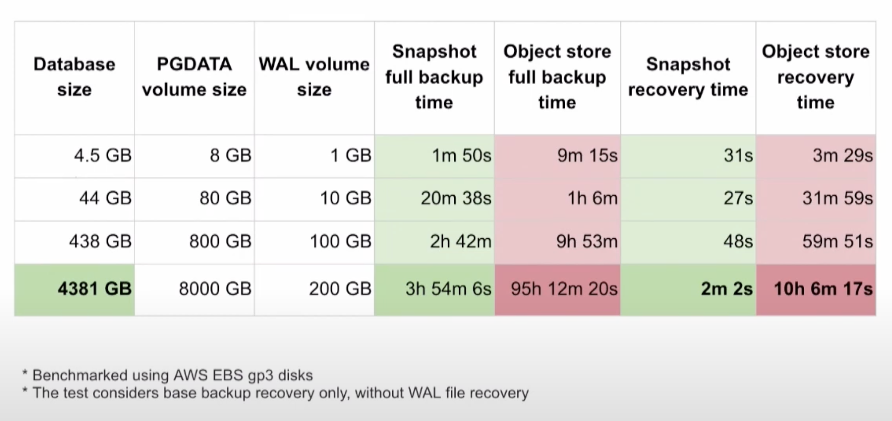

# The Gems of Kubernetes' Latest Features

David Pech
2025


---

# David Pech


---

# Why bother learning about that hyped K-word?

"So you can have the same features as before on VMs."

... but of course this time *smarter*.

---

# Online Pod Resizing

**In-place vertical scaling without restarts**
- Status: **Beta** in Kubernetes 1.34
- KEP: [1287](https://github.com/kubernetes/enhancements/tree/master/keps/sig-node/1287-in-place-update-pod-resources)

---

# The Problem Before

```yaml
apiVersion: v1
kind: Pod
metadata:
  name: memory-hungry-app
spec:
  containers:
  - name: app
    image: my-app:v1
    resources:
      limits:
        memory: "2Gi" # <-- restart
        cpu: "1000m" # <-- restart
```

---

<!-- # And Now -->

```yaml
apiVersion: v1
kind: Pod
metadata:
  name: resizable-app
spec:
  containers:
  - name: app
    image: my-app:v1
    resources:
      limits:
        memory: "4Gi" # CHANGED
        cpu: "2000m" # CHANGED
    resizePolicy:
    - { resourceName: memory, restartPolicy: NotRequired }
    - { resourceName: cpu, restartPolicy: NotRequired }
```

---

# Why Online Pod Resizing Matters

**Use Cases:**
- **Databases**: Scale memory up for heavy query periods
- **Auto-scaling**: Faster response to load changes

**But:**
- You probably don't care about CPU .limits
- Memory can scale only up
- Java

---

# Pod-level Resource Allocation

**Simplify with per-pod resource constraints**
- Status: **Beta** since Kubernetes 1.34
- KEP: [2837](https://github.com/kubernetes/enhancements/blob/master/keps/sig-node/2837-pod-level-resource-spec/README.md)

---

<!-- # The Problem Before -->

```yaml
apiVersion: v1
kind: Pod
metadata:
  name: database-pod
spec:
  containers:
  - name: postgres
    image: postgres:18
    resources:
      requests:
        cpu: "2000m"
        memory: "4Gi"
      limits:
        cpu: "2000m"
        memory: "4Gi"
  - name: exporter
    image: postgres_exporter
    resources: # <-- ??? WHAT TO PUT HERE?
      requests:
        cpu: "20m"
        memory: "4Mi"
      limits:
        cpu: "200m"
        memory: "40Mi"
```

---

<!-- # And Now -->

```yaml
apiVersion: v1
kind: Pod
metadata:
  name: database-pod
spec:
  resources: # Pod-level definition, shared between containers
    requests:
      cpu: "2000m"
      memory: "4Gi"
    limits:
      cpu: "2000m"
      memory: "4Gi"
  containers:
  - name: postgres
    image: postgres:18
  - name: exporter
    image: postgres_exporter
```

---

# Why Pod-level Allocation Matters

**Use Cases:**
- Sidecars
- (Uneven containers)

**Benefits:** Easier to understand, Less waste, QoS class

**But:** Some tooling not ready yet, No in-place resize

---

# VolumeSnapshots & VolumeGroupSnapshots

**Simplified backup and restore across multiple volumes**
- Status: VolumeSnapshots **Stable**, VolumeGroupSnapshot **Beta** in 1.34
- KEP: [3476](https://github.com/kubernetes/enhancements/tree/master/keps/sig-storage/3476-volume-group-snapshot)

---

# The Problem Before

```bash
# Manual, error-prone backup process
kubectl exec mysql-pod -- mysqldump > backup.sql
kubectl cp mysql-pod:backup.sql ./local-backup.sql

# No coordination between related volumes
# Risk of inconsistent state across multiple volumes
# Manual restore process
```

---

# And Now

```yaml
# Snapshot for single PVC
apiVersion: snapshot.storage.k8s.io/v1
kind: VolumeSnapshot
metadata:
  name: mysql-snapshot-20241001
spec:
  volumeSnapshotClassName: csi-snapshotter
  source:
    persistentVolumeClaimName: mysql-pvc
# --> real data managed by VolumeSnapshotContent
```

---

# And Now

```yaml
# Multiple PVCs at the same time (multiple "mounts")
apiVersion: groupsnapshot.storage.k8s.io/v1beta1
kind: VolumeGroupSnapshot
metadata:
  name: app-group-snapshot
spec:
  volumeGroupSnapshotClassName: csi-group-snapshotter
  source:
    selector:
      matchLabels:
        app: database-cluster
# --> generates VolumeGroupSnapshotContent
```

---

# Why VolumeSnapshots Matter



[Source (Kubecon NA, Chicago)](https://kccncna2023.sched.com/event/1R2ml/disaster-recovery-with-very-large-postgres-databases-gabriele-bartolini-edb-michelle-au-google)

---

# Why VolumeSnapshots Matter

**Use Cases:**
- **Database Backups**: Consistent point-in-time snapshots
- **Disaster Recovery**: Quick restoration from snapshots
- **Development/Testing**: Clone production data safely
- **Multi-volume Applications**: Coordinated snapshots across volumes

---

# OCI ImageVolumes

**Reduce image duplication and network overhead**
- Status: **Beta** in Kubernetes 1.34
- KEP: [4639](https://github.com/kubernetes/enhancements/issues/4639)

---

# The Problem Before

```Dockerfile
FROM ai/gemma3:latest as model

FROM myapp:latest AS app

# Copy model files
ADD --from=model model-file /mnt/model-file
```

```bash
docker build -t myapp:latest-with-model
```

---

# The Problem Before

```yaml
apiVersion: v1
kind: Pod
metadata:
  name: my-fancy-app
spec:
  containers:
  - name: my-fancy-model-including-app
    image: myapp:latest-with-model
```

---

# The Problem Before

Container design - either lightweight + limited:

- CloudNativePG

Or bulky:

- StackGres (100+ extensions)

---

# The Problem Before

```yaml
apiVersion: v1
kind: Pod
metadata:
  name: my-favourite-app
spec:
  initContainers:
    # download the dependency here
  containers:
  - name: my-fancy-model-including-app
    image: myapp
    volumeMounts:
    - name: model-file
      mountPath: /mnt/
      readOnly: true
```

---

```yaml
apiVersion: v1
kind: Pod
metadata:
  name: my-favourite-app
spec:
  volumes:
  - name: model-image
    image:
      reference: myregistry/large-base:v1
      pullPolicy: IfNotPresent
  containers:
  - name: my-fancy-model-including-app
    image: my-fancy-app-without-model
    volumeMounts:
    - name: model-image
      mountPath: /mnt/
      readOnly: true
```

---

# Why OCI ImageVolumes Matter

**Use Cases:**
- **ML Workloads**: Share large model files across containers
- **Microservices**: Common base files and dependencies
- **Addons/Extensions**: Provide as regular image
- **Edge Computing**: Minimize bandwidth usage

---

# Node SWAP Support

**Handle memory spikes with flexible memory management**
- Status: **Beta** in Kubernetes 1.34 (Burstable QoS only)
- Next: Enhanced controls and monitoring in 1.35
- KEP: [2400](https://github.com/kubernetes/enhancements/tree/master/keps/sig-node/2400-node-swap)

(Off by default)

---

# The Problem Before

No SWAP support.

---

```yaml
# this fragment goes into the kubelet's configuration file
memorySwap:
  swapBehavior: LimitedSwap
---
# Only non-high-priority Pods under the Burstable QoS tier are permitted to use swap.
apiVersion: v1
kind: Pod
metadata:
  name: my-app
spec:
  containers:
  - name: java-app
    image: openjdk:11
    resources:
      requests:
        memory: "2Gi"
      limits:
        memory: "4Gi"
```

---

# Why SWAP Support Matters

**Use Cases:**
- **Applications with Dormant Memory**: Java, batch operations, ...
- **Cost optimization**
- **You are in charge** and responsible for your choices

---

# Job Success and Failure Policies

**Better job management with fine-grained control**
- Status: both **Stable** in Kubernetes 1.34
- KEP: 3329 (failure), 3998 (success)

---

# The Problem Before

```yaml
apiVersion: batch/v1
kind: Job
metadata:
  name: my-favourite-job
spec:
  backoffLimit: 3  # Retry 3 times, that's it
  template:
    spec:
      containers:
      - name: batch-processor
        image: batch-app:v1
      restartPolicy: Never
```

---

<!-- # And Now (podFailurePolicy) -->

```yaml
apiVersion: batch/v1
kind: Job
metadata:
  name: my-other-job
spec:
  backoffLimit: 5
  template:
    spec:
      containers:
      - name: batch-processor
        image: batch-app:v1
      restartPolicy: Never # required if using .podFailurePolicy
  podFailurePolicy:
    rules:
    - action: FailJob
      onExitCodes:
        containerName: batch-processor
        operator: In
        values: [1, 2]  # Fatal errors - don't retry
    - action: Ignore
      onPodConditions:
      - type: DisruptionTarget  # Node maintenance - retry
```

---

<!-- # And Now (jobSuccessPolicy) -->

```yaml
apiVersion: batch/v1
kind: Job
metadata:
  name: my-matrix-job
spec:
  backoffLimit: 5
  template:
    spec:
      containers:
      - name: batch-processor
        image: batch-app:v1
      restartPolicy: Never
  parallelism: 10
  completions: 10
  completionMode: Indexed
  successPolicy:
    rules:
    - succeededIndexes: "0-9"
      succeededCount: 8  # 80% success rate is enough
```

---

# Why Job Policies Matter

**Use Cases:**
- **Data Processing**: Skip corrupted data, continue with rest
- **ML Training**: Handle node failures gracefully
- **ETL Pipelines**: Categorize transient vs permanent failures
- **Batch Analytics**: Partial success scenarios

So your jobs don't need to be idempotent.

---

# What's Next in Kubernetes

**Upcoming features to watch:**

- **Gang Scheduling** - Coordinate scheduling of related pods ("PodGroup")
  - KEP: [4671](https://github.com/kubernetes/enhancements/issues/4671)
  - Status: Alpha development for 1.35 (?)

---


# Thank You!

*Let's bring more workloads on Kubernetes!*

**Questions?**


